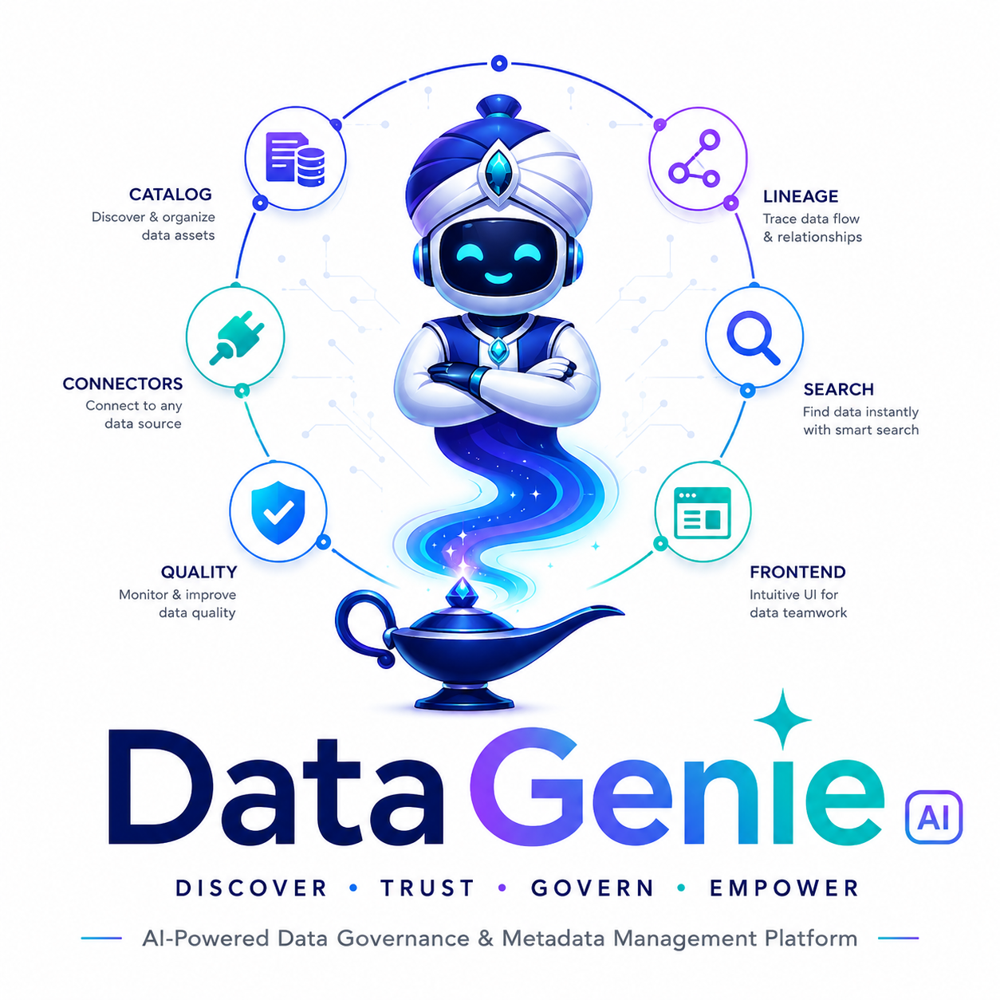

# DataGenie



[](https://github.com/itismohan/datagenie/actions/workflows/ci.yml)
[](https://github.com/itismohan/datagenie/actions/workflows/pages.yml)


**DataGenie** is an enterprise data-governance platform that brings catalog discovery, metadata stewardship, explainable quality, operational lineage, and proposal-based governance into one accountable operating model. It is designed to help teams find and use data with context while retaining human authority for governed change.

> **Release posture:** The current implementation is conditionally ready for a **controlled multi-tenant staging canary**, not general availability. General availability remains gated on verified PostgreSQL RLS using a non-owner application role, managed secret resolution, deployed DNS/TLS and egress controls, restore-drill evidence, and named operational ownership.[1] [2]

The public product and documentation site is available at **[itismohan.github.io/datagenie](https://itismohan.github.io/datagenie/)**.

## What the platform provides

DataGenie keeps discovered technical metadata separate from stewarded business context, enabling new harvests without overwriting accountable human curation. It combines durable connector execution, tenant-bound catalog operations, quality evidence, lineage impact, permission-aware search, and an audited governance boundary.[2] [3]

| Capability | Current implementation focus | Primary guide |
|---|---|---|
| **Catalog and discovery** | Stable asset records, curated metadata, ownership, classifications, certification, tenant-scoped search, and freshness context. | [Governed discovery guide](docs/governance-discovery-guide.md) |
| **Connectors and jobs** | PostgreSQL and Snowflake connector framework, durable jobs, incremental synchronization, retries, cancellation, and job history. | [Connector framework guide](docs/connector-framework-guide.md) |
| **Quality and lineage** | Explainable, versioned quality checks and operational lineage with downstream impact context. | [Quality operations](docs/quality-operations.md) · [Governance and lineage contract](docs/governance-lineage-contract.md) |
| **Governance** | Evidence-rich proposals, steward inbox review, policy rechecks, nonce/hash confirmation, and immutable audit trails. | [Governance discovery guide](docs/governance-discovery-guide.md) |
| **MCP integration** | Tenant-bound governed discovery plus three proposal-intent tools; hosts cannot approve, execute, or directly mutate governed assets. | [Tenant-admin onboarding](docs/mcp-tenant-admin-onboarding.md) |
| **Operations** | Structured logs, request IDs, probes, metrics, Compose topology, migrations, backup/restore procedures, and staged rollout controls. | [Production operations](docs/production-operations.md) |

## Architecture and governance boundary

The platform is organized around dedicated service boundaries for catalog, connector, quality, lineage, search, and MCP access. The Catalog API is the authoritative governance and tenant-isolation boundary; background connector and quality work is durable rather than tied to a request-serving process.[2]

MCP is deliberately constrained. The gateway exposes governed reads and proposal intent, while approval and execution remain behind the steward inbox and server-side checks for identity, policy, proposal hash, nonce, and current resource version. This ensures that an agent or host cannot turn a recommendation into a governed mutation.[4] [5]

## Quick start

DataGenie uses environment-specific configuration. Do not commit `.env` files, connection strings containing credentials, JWT signing keys, source passwords, or other secrets. The tracked [`.env.example`](.env.example) file defines the expected configuration shape.[3]

```bash
cp .env.example .env
# Set local-only passwords and a unique JWT signing secret.

docker compose --env-file .env -f infra/docker-compose.yml up --build
```

The local platform starts PostgreSQL, Redis, Neo4j, migrations, and the Catalog, Connector, Lineage, Quality, and Search service boundaries. The Catalog API is available at `http://localhost:8000`; its interactive API documentation is at `http://localhost:8000/docs`.[3]

| Local endpoint | Purpose |
|---|---|
| `GET /health/live` | Process liveness probe. |
| `GET /health/ready` | Readiness probe that confirms a database query. |
| `GET /metrics` | Prometheus metrics for requests, latency, and errors. |
| `GET /docs` | Versioned OpenAPI documentation. |

For observability locally, start Compose with `--profile observability`; Prometheus becomes available on `http://localhost:9090`.[3]

## Documentation

The [documentation index](docs/README.md) groups the authored guides by reader and outcome. Start with the path that reflects your role rather than attempting to read the entire repository history.

| If you need to… | Start here |
|---|---|
| Understand product and governance behavior | [Governed discovery and lineage guide](docs/governance-discovery-guide.md) |
| Integrate with the REST API | [API integration guide](docs/api-integration-guide.md) |
| Register a governed MCP host or test tenant | [MCP tenant-admin onboarding pack](docs/mcp-tenant-admin-onboarding.md) |
| Certify an enterprise MCP partner | [MCP partner certification](docs/mcp-partner-certification.md) |
| Operate a staging or production-like environment | [Production operations](docs/production-operations.md) · [Operations runbook](docs/operations-runbook.md) |
| Assess production readiness and release conditions | [Launch-readiness assessment](docs/launch-readiness-assessment.md) · [Release architecture](docs/production-release-architecture.md) |
| Make a material engineering change | [Specification-driven development](specs/README.md) |
| Work on the public product site | [Public-site guide](apps/public-site/README.md) |

## Engineering workflow

DataGenie uses specification-driven development (SDD) for material changes. A change that affects user behavior, a contract, migration, authorization, tenant boundary, governance workflow, background worker, infrastructure, observability, or customer operations must have a scoped change specification and traceability evidence. Documentation-only corrections and other non-behavioral adjustments may use the documented exemption path.[6]

The core invariants include tenant isolation, policy consistency across UI/API/MCP, evidence-bearing quality, human confirmation for governed changes, request correlation, and backward-compatible contracts. See the [engineering constitution](specs/constitution.md) and the [SDD workflow](specs/README.md) before beginning a material change.[6]

## Security and support principles

Every user-visible request should carry an `X-Request-ID`. DataGenie returns that value and uses it to correlate logs, safe error responses, audit events, and the MCP execution ledger without persisting bearer tokens, raw prompts, source credentials, or confirmation nonces.[3] [4]

Report suspected security issues privately to the repository maintainers. Do not include tokens, secrets, customer metadata, raw rows, or personally identifiable information in issues, pull requests, logs, or support requests.

## Release evidence

Continuous integration validates SDD traceability, migration and regression coverage, service tests, dependency scanning, Compose topology, Prometheus configuration, and operational script syntax. A passing workflow is necessary but does not by itself establish a production release; the staged evidence gates remain authoritative.[1] [2]

## References

[1]: docs/launch-readiness-assessment.md "DataGenie Launch-Readiness Assessment"
[2]: docs/production-release-architecture.md "DataGenie Production Release Architecture"
[3]: docs/production-operations.md "DataGenie Production Operations Guide"
[4]: docs/mcp-authorization-reference.md "MCP Authorization and Streamable HTTP Implementation Reference"
[5]: docs/mcp-tenant-admin-onboarding.md "DataGenie MCP Tenant-Admin Onboarding Pack"
[6]: specs/README.md "DataGenie Specification-Driven Development"
