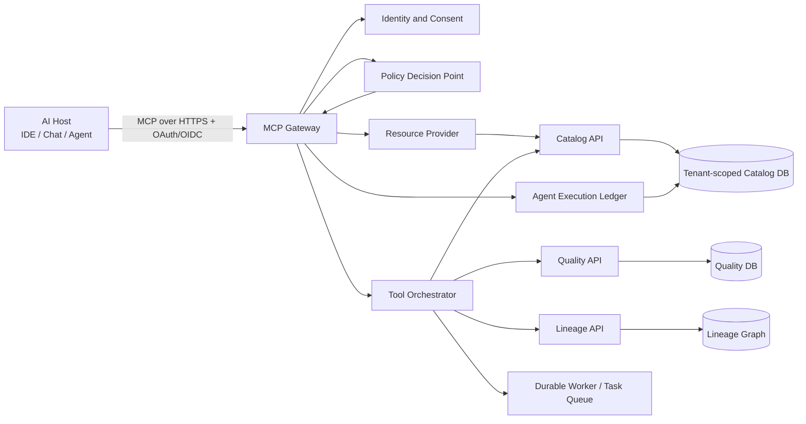

# DataGenie SDD and MCP Transformation Blueprint

**Author:** Manus AI
**Status:** Strategic architecture recommendation
**Scope:** Converting the existing DataGenie platform into a specification-driven product and a governed Model Context Protocol capability.

## Executive recommendation

**Yes—DataGenie should become both specification-driven and MCP-native.** However, the correct goal is not to expose the existing REST API wholesale as MCP tools. That would create an attractive demo but a weak enterprise product: broad tool surfaces would bypass the product’s governance intent, create prompt-injection and confused-deputy risk, and make it difficult to prove what an AI was allowed to do.

The stronger strategy is to make **specifications the product-control plane** and build an **MCP adapter as a governed agent interface** over the existing tenant-scoped domain services. DataGenie then becomes the system that turns organizational intent—policy, ownership, quality thresholds, usage rules, and approval requirements—into safe AI actions with evidence and human accountability.

> **Positioning thesis:** DataGenie should not compete as another “chat with your catalog” product. It should become the **governed context and action layer for enterprise AI**, answering not only *what data exists*, but also *whether an agent may use it, why it is trustworthy, what will be affected, and which person must approve the next step*.

The platform already has unusually good prerequisites: versioned OpenAPI, tenant boundaries, RBAC, audit records, steward review workflows, explainable quality evidence, lineage, durable background work, approval-gated suggestions, and production-readiness controls. These assets mean DataGenie can build an MCP server that is **more trustworthy than a generic database MCP**, rather than merely more convenient.

| Decision | Recommendation | Why |
|---|---|---|
| SDD approach | Adopt a **repository-native SDD operating model**, trialing OpenSpec-style change artifacts before making any tool mandatory. | It is brownfield-friendly, keeps intent in Git, and avoids introducing a large process migration before the team proves value. [1] |
| MCP posture | Build a **remote, tenant-aware DataGenie MCP gateway** behind the existing TLS ingress. | The value comes from controlled multi-user access, central policy enforcement, audit, and durable work—not a developer-local stdio convenience server. [2] |
| First MCP release | Read-only discovery, provenance, quality, and impact analysis. | These tools are high-value, safe by default, and demonstrate governance differentiation before any write path exists. |
| Write actions | Proposal-first, approval-gated, idempotent, and explicitly confirmed. | MCP tools are arbitrary actions; governance changes must preserve current human-review guarantees. [2] |
| Product north star | **Governed agent success rate:** proportion of AI data tasks completed with approved context, evidence, and no policy violation. | It measures whether DataGenie safely enables work, rather than merely serving tool calls. |

## Why this is the right moment

MCP standardizes a host–client–server model using JSON-RPC and exposes three core server primitives: **resources**, **prompts**, and **tools**. It also defines extensions for asynchronous tasks and interactive applications.[2] Its architecture deliberately keeps host orchestration and user-consent responsibility separate from focused, composable servers.[3]

Specification-driven development (SDD) makes requirements, architecture, contracts, tests, and operations evidence first-class artifacts. Mature SDD practices link requirements to design, implementation tasks, tests, and production feedback instead of treating a PRD as a document that disappears once coding starts.[4] This matches DataGenie’s own mission: governed metadata is already a kind of living specification for enterprise data. The product should apply the same discipline to its own behavior.

The combination has a compounding effect:

| Without SDD | With SDD | DataGenie consequence |
|---|---|---|
| AI agents act from prompts and undocumented assumptions. | Agents receive a reviewed capability contract, policy context, and acceptance criteria. | Fewer unsafe or surprising agent actions. |
| API/MCP behavior drifts from documentation. | OpenAPI, MCP manifests, test cases, and release evidence are derived from a change specification. | Customer integrations become repeatable and supportable. |
| Governance workflows are implemented as isolated endpoints. | Every workflow has a business spec, domain policy, approval state machine, and audit contract. | New governance capabilities retain consistent human control. |
| Production incidents cause patches only. | Incidents update non-functional requirements, constraints, and regression scenarios. | Reliability learning becomes durable product knowledge. |

## Current readiness assessment

### Assets to preserve and reuse

| Existing DataGenie capability | SDD role | MCP role |
|---|---|---|
| Tenant-scoped PostgreSQL model and RLS migration boundary | Non-negotiable architecture constraint in the project constitution. | Tenant context must be derived from validated identity and bound to every tool/resource request. |
| JWT/OIDC boundary, RBAC, audit trail | Authentication and authorization specification baseline. | Map MCP scopes to narrowly defined capabilities; record host, client, user, tenant, tool, input digest, result classification, and approval state. |
| Glossary, classifications, certifications, stewardship workflows | Domain vocabulary and policy specification source. | Serve contextual resources and evidence-bearing discovery results. |
| Quality rules, incidents, explainable evidence | Testable trust contract for data use. | Offer tools that explain quality and impact; do not present opaque scores as truth. |
| Typed lineage and impact endpoints | Core operational decision graph. | Power upstream/downstream and “what breaks?” tools. |
| Governance suggestions requiring review | Existing human-in-the-loop pattern. | Become the write-action pattern for every governance-impacting MCP tool. |
| Durable connector/quality workers and dead-letter handling | Operational and asynchronous task specification. | Model long-running MCP work as durable handles/tasks, never blocking a host request. |
| Versioned OpenAPI and contract-drift checks | Canonical external REST contract. | Remain the HTTP service contract beneath the MCP adapter; do not duplicate business logic. |

### Gaps to close before broad MCP exposure

| Gap | Why it matters | Required resolution |
|---|---|---|
| Cross-service tenancy proof | Catalog has the strongest tenant foundation; quality, lineage, and search must have equivalent end-to-end tenant enforcement. | Run a service-by-service tenant-boundary specification and adversarial test suite before enabling cross-service MCP tools. |
| MCP authorization profile | Existing OIDC validates users but does not yet expose MCP protected-resource metadata, audience/scopes, or client consent. | Implement remote MCP OAuth/OIDC resource-server controls; validate token audience and map scopes to tool capabilities. [5] |
| Agent-consent policy | A model can choose tools, but governance-impacting actions require a human decision. | Define the proposal/approval/execute protocol and supported host UX before write tools. |
| Policy evaluation service | RBAC alone cannot express purpose, classification, certification, asset criticality, and use-case restrictions. | Introduce a central policy-decision interface; start rule-based, not model-based. |
| Tool-level observability | Generic API logs do not explain agent intent or tool selection. | Add an agent execution ledger, policy decision records, evidence digests, and per-tool SLOs. |
| Egress and prompt-injection defenses | MCP tools can cause data exfiltration or unsafe side effects when descriptions/content are untrusted. | Use output classification, content boundaries, allowlisted connectors, egress policy, confirmation UX, and adversarial evaluation. [6] |

## Target operating model: DataGenie SDD

### 1. Establish an engineering constitution

Create `specs/constitution.md` as the repository’s non-negotiable architecture contract. It should not describe implementation preferences; it should define the invariants that every material change must prove.

| Constitution article | Enforced rule |
|---|---|
| Tenant isolation | A tenant identifier originates from validated identity, cannot be caller-overridden, scopes every persistence/query/action path, and has negative tests. |
| Human governance | An AI may create a suggestion or proposal but cannot apply governance-impacting state without an eligible human approval. |
| Evidence before authority | Quality, classification, certification, lineage, and policy conclusions must identify evidence, provenance, version, timestamp, and confidence. |
| Contract first | Public HTTP, event, MCP, data, and database migration contracts are specified and tested before implementation. |
| Least capability | Every MCP tool has explicit scope, input schema, data classification, side-effect class, rate limit, timeout, audit event, and error model. |
| Durable operations | Long-running work uses durable jobs with idempotency, cancellation, timeout, retry, dead-letter handling, and operator replay. |
| Secure by composition | No raw credentials; no token passthrough; TLS/egress boundaries and dependency security checks are required. |
| Compatibility discipline | API/MCP evolution is additive within a major version or includes a documented migration/deprecation plan. |
| Observable decisions | Policy, approval, tool invocation, and outbound side-effect decisions are traceable using stable correlation IDs. |

### 2. Keep specifications close to code

Use a lightweight, Git-native structure. An OpenSpec-style workflow is a good fit for brownfield adoption because it supports exploration, proposal, requirement deltas, design, tasks, verification, and archiving without requiring one giant up-front rewrite.[1]

```text
specs/
  constitution.md
  platform/
    tenancy.md
    identity-and-authorization.md
    governance-approval.md
    ai-assistance-policy.md
    observability-and-slos.md
  domains/
    catalog.md
    quality.md
    lineage.md
    discovery.md
    customer-operations.md
  contracts/
    openapi/
    events/
    mcp/
  changes/
    0001-mcp-read-only-discovery/
      proposal.md
      requirements.md
      design.md
      threat-model.md
      data-model.md
      contracts/
      test-plan.md
      rollout.md
      tasks.md
      evidence.md
  archive/
```

### 3. Make a change specification the unit of work

Every non-trivial change should start with a change folder. A pull request must reference one change ID and cannot merge until its specification and evidence are reviewed.

| Artifact | Required content | Approval owner |
|---|---|---|
| `proposal.md` | Customer problem, business outcome, scope, non-goals, affected tenants/domains. | Product owner |
| `requirements.md` | Testable SHALL requirements, user stories, negative scenarios, measurable success criteria. | Product + domain owner |
| `design.md` | Components, sequence/data-flow diagram, decisions, alternatives, dependency impact. | Solution architect |
| `threat-model.md` | Assets, trust boundaries, misuse cases, prompt-injection/SSRF/identity concerns, mitigations. | Security owner |
| `contracts/` | OpenAPI/MCP/event/data-model changes and compatibility plan. | API/platform owner |
| `test-plan.md` | Unit, integration, contract, authorization, tenancy, adversarial, performance, and rollback checks. | Engineering + QA/SRE |
| `rollout.md` | Migration, flags, canary, monitoring, rollback and support plan. | SRE/on-call owner |
| `evidence.md` | Executed tests, reviews, release revision, metrics and production verification. | Release manager |

### 4. Trace requirements all the way to evidence

Create a machine-readable `traceability.yaml` in each change. It should map requirement IDs to contracts, source modules, tests, dashboards, rollout flags, and owners. CI should reject a completed requirement without test evidence and reject a public contract change without documentation/artifact updates.

```yaml
requirements:
  DG-MCP-READ-001:
    statement: "An authorized analyst SHALL retrieve only assets visible to the active tenant."
    contracts:
      - contracts/mcp/tools/search_governed_assets.json
    implementation:
      - apps/mcp-server/app/tools/discovery.py
    tests:
      - apps/mcp-server/tests/test_tenant_search.py::test_cross_tenant_assets_are_never_returned
    observability:
      - mcp_tool_calls_total{tool="search_governed_assets"}
    owner: data-platform
```

### 5. Add SDD gates to the delivery pipeline

| Gate | CI check | Merge consequence |
|---|---|---|
| Specification completeness | Required artifacts present; no unresolved critical clarification; requirement IDs unique. | Block merge. |
| Constitution compliance | Automated checklist plus architect exception record. | Block merge unless exception is explicitly approved and time-bounded. |
| Contract compatibility | OpenAPI and MCP schema diff classified as additive/deprecated/breaking. | Block undocumented breaking changes. |
| Traceability | Every requirement maps to at least one test; every changed public operation maps to docs. | Block merge. |
| Security | Secret scan, dependency audit, SAST, tenant negative tests, MCP tool threat checks. | Block merge. |
| Operations | Migration validation, rollout/rollback plan, metric/alert declaration, load/timeout tests where applicable. | Block production promotion. |
| Evidence | Staging canary evidence and approval record attached to the change. | Block general availability. |

## Target architecture: DataGenie MCP gateway

### Architectural principle

**MCP is an adapter, not the domain core.** The server should be a separate deployable `mcp-gateway` that owns protocol negotiation, consent, scope enforcement, tool schemas, rate limits, safety policy, agent audit events, and response shaping. It should invoke existing DataGenie domain services through a private service boundary; it must not connect directly to catalog, quality, or lineage databases.



| Component | Responsibility | Must not do |
|---|---|---|
| MCP gateway | Implements MCP transport/session/capability negotiation, authenticates caller, applies scope/policy, validates tool input/output, and emits agent audit records. | Reimplement catalog, quality, or lineage business logic. |
| Identity and consent | Performs OAuth/OIDC resource-server validation, maps tenant/role/scopes, and records human consent for high-impact tools. | Trust a tool argument such as `tenant_id`, role, or approval state. |
| Policy decision point | Evaluates subject, tenant, purpose, asset classification, certification, quality, lineage, and action class. | Make opaque ML-only allow/deny decisions without explainable rule evidence. |
| Resource provider | Publishes read-only, versioned context with provenance and policy labels. | Return unrestricted raw connector secrets, hidden assets, or unbounded result sets. |
| Tool orchestrator | Runs focused operations, creates durable task handles, honors idempotency and cancellation. | Execute multi-step governance changes without preview and confirmation. |
| Agent execution ledger | Captures caller, host/client identity, tool name/version, input/output digests, policy decision, evidence refs, approval state, and correlation IDs. | Store raw sensitive input/output unnecessarily. |

### Transport and identity

For a remote MCP server, use a standards-aligned HTTP transport protected by OAuth/OIDC. The MCP authorization guidance treats the server as an OAuth resource server and requires audience validation when authorization is enabled; it also explicitly forbids token passthrough to downstream services.[5]

| Concern | Design decision |
|---|---|
| Client authentication | OAuth 2.1/OIDC authorization code with PKCE for interactive hosts; narrowly scoped workload identity for approved enterprise agents. |
| Resource metadata | Expose protected-resource metadata and authorization-server discovery endpoints before enabling third-party MCP clients. |
| Tenant binding | Derive tenant only from validated token claims; bind it to every gateway, service, job, and audit context. |
| Audience | Issue or validate tokens specifically for the DataGenie MCP resource; do not reuse a token minted for another API. |
| Scopes | Use capabilities such as `catalog:read`, `lineage:read`, `quality:read`, `governance:propose`, `governance:approve`, `ingestion:operate`, `export:read`. |
| Client consent | Require explicit consent for non-read-only tools. Display tool purpose, affected assets, data classification, requested scope, side effect, and destination. |
| Downstream calls | Use service-to-service identity plus signed, tenant-bound actor context. Do not forward the MCP client token to downstream services. |
| Network control | Enforce TLS, ingress rate limits, egress allowlists, no automatic redirects for external tool paths, and private/metadata IP blocking. [6] |

### MCP surface: resources, prompts, and tools

Resources should be primarily read-only, cacheable, explicit about provenance, and policy-labelled. Prompts should offer repeatable, human-readable workflows. Tools should be narrowly scoped actions—not a REST endpoint mirror.

#### Resources

| Resource URI pattern | Content | Access policy |
|---|---|---|
| `datagenie://catalog/assets/{asset_id}` | Governed asset profile, owner, description, classification, certification, quality summary, permitted-use status, and metadata version. | Asset read policy; response redaction by classification and role. |
| `datagenie://catalog/assets/{asset_id}/columns` | Column contract with data type, description, classification and glossary mappings. | No sample values; role/classification controls. |
| `datagenie://governance/glossary/{term}` | Approved definition, steward, domain, mappings, version and review history summary. | Approved terms visible to authorized tenant members. |
| `datagenie://quality/assets/{asset_id}/latest` | Explainable quality run, rule versions, timestamps, evidence links and incident state. | Quality read policy; evidence redacted where needed. |
| `datagenie://lineage/assets/{asset_id}` | Typed upstream/downstream graph summary with provenance, confidence and freshness. | Lineage read policy. |
| `datagenie://policy/use/{asset_id}?purpose={purpose}` | Policy decision, obligations, evidence and next required approval. | User/agent-specific; never cache across principals. |

#### Prompts

| Prompt | Outcome |
|---|---|
| `assess_data_for_use` | Explains whether an asset is suitable for a declared purpose, using certification, classification, ownership, freshness, quality and lineage evidence. |
| `investigate_quality_incident` | Summarizes incident evidence, owners, downstream impact, and remediation options without closing the incident. |
| `explain_lineage_impact` | Builds a cited narrative of upstream sources, transformation provenance, consumers, confidence and schema-change impact. |
| `prepare_governance_proposal` | Produces a review-ready description, owner, glossary mapping, classification correction, or certification proposal—never applies it. |
| `prepare_connector_onboarding` | Generates a least-privilege connection checklist and test plan from a reviewed connector specification. |

#### Tools: sequence by risk, not by REST domain

| Release | Tool | Side effect | Guardrails |
|---|---|---|---|
| R1 | `search_governed_assets` | None | Tenant scope, result limit, faceted policy explanation, no raw data. |
| R1 | `get_asset_context` | None | Classification-aware redaction, provenance/version data, bounded column payload. |
| R1 | `get_quality_evidence` | None | Explainable rule/result/incident output, no unsupported “trust score.” |
| R1 | `analyze_lineage_impact` | None | Depth/result limits, confidence/provenance included, async handle for expensive traversals. |
| R1 | `check_data_use_policy` | None | Requires declared purpose; returns allow/deny/obligations/evidence, not a bare boolean. |
| R2 | `create_governance_proposal` | Creates proposal only | AI/human input labelled, evidence required, idempotency key, no direct asset mutation. |
| R2 | `request_certification_review` | Creates workflow request | Eligible requester, evidence payload, steward workflow, audit. |
| R2 | `schedule_quality_check` | Creates durable job | Asset authorization, rule proposal/selection, time/cost bounds, confirmation. |
| R3 | `execute_approved_change` | Applies approved change | Immutable proposal ID, approval state revalidated server-side, confirmation nonce, change preview hash, idempotency key, audit/event. |
| R3 | `submit_ingestion_job` | Creates durable job | Read-only source credential reference, source permission, rate/cost guardrails, preview/confirmation. |

### The proposal-first mutation protocol

Never let a model tool directly change governance state. Implement every mutation as a state machine:

```text
DRAFT → VALIDATED → PROPOSED → HUMAN_APPROVED → CONFIRMED_FOR_EXECUTION → EXECUTED
                      ↘ REJECTED / EXPIRED / SUPERSEDED
```

1. **Draft:** Agent supplies structured intent, evidence, and declared purpose.
2. **Validated:** Server checks schemas, tenant, roles, policy, conflicts, current version and impact.
3. **Proposed:** Server stores an immutable proposal/diff; response includes affected resources and evidence.
4. **Human approved:** An eligible owner/steward approves in DataGenie UI or an independently authenticated approval endpoint.
5. **Confirmed for execution:** The initiating user or host confirms the precise proposal hash after seeing preview.
6. **Executed:** Server revalidates policy/version/approval, applies an idempotent change, emits audit/event records and returns before/after evidence.

This turns MCP from an uncontrolled command channel into a **governed delegation protocol**.

## How SDD and MCP reinforce each other

Every MCP capability must itself be specified. A `tool` is a product contract with users, hosts, tenants, security teams, and support—not a Python function.

| SDD artifact | MCP-specific requirement |
|---|---|
| Requirement | User story, declared purpose, actor, asset/data classification, expected outcome, prohibited behavior, and measurable acceptance scenario. |
| Design | Transport, identity/scopes, policy path, resource/tool/prompt selection, input/output schemas, async/task behavior, caching, error taxonomy and consent UX. |
| Threat model | Prompt injection, indirect prompt injection from metadata, confused deputy, scope escalation, token audience, SSRF, state-handle theft, data exfiltration and approval bypass. |
| Contract | MCP JSON schema, tool annotations, resource URI/version, errors, rate limits, idempotency/confirmation semantics and compatibility policy. |
| Test plan | Host interoperability, tenant negative tests, scope matrix, prompt-injection adversarial cases, policy/evidence correctness, approval state race conditions, timeout/retry/cancel tests. |
| Rollout | Feature flag per tenant/host/tool, allowlisted early adopters, read-only canary, audit review, kill switch, and backward-compatibility plan. |
| Evidence | Tool-call samples with redacted data, policy decisions, audit records, tenant isolation results, performance/SLO metrics and sign-offs. |

## Detailed implementation sequence

### Phase 0 — Establish the SDD baseline

1. Create `specs/constitution.md` with the nine DataGenie invariants defined above.
2. Create canonical templates for proposal, requirement, design, threat model, contracts, test plan, rollout and evidence.
3. Add `traceability.yaml` schema and CI validation that requires all implementation tasks to reference a change ID.
4. Backfill only the highest-risk existing domains: tenant isolation, governance approval, quality evidence, connector execution, and API compatibility. Do **not** attempt to retro-document every historical feature.
5. Add PR templates that require change ID, affected contract versions, tenant impact, security impact, migration, rollback, tests, and release evidence.
6. Pilot the workflow on one bounded change: **“MCP read-only governed discovery.”** Evaluate whether it improves review quality and delivery predictability before formalizing the tool choice.

**Exit gate:** Two real feature changes complete the full artifact lifecycle; reviewers can trace acceptance criteria to tests and release evidence without asking engineers for hidden context.

### Phase 1 — Create an internal policy decision interface

1. Specify a single `evaluate_access(subject, tenant, action, resource, purpose, context)` contract.
2. Start with deterministic rules derived from existing RBAC, tenant scope, classification, certification, owner/steward assignment, quality freshness, and lifecycle status.
3. Return a structured decision: `allow`, `deny`, `allow_with_obligations`, or `requires_human_approval`, including rule IDs, evidence references, and expiry.
4. Require existing REST paths gradually to call it for the complex authorization decisions, avoiding an MCP-only policy universe.
5. Add policy decision audit events and test matrices for role × tenant × asset classification × purpose × action.

**Exit gate:** The same policy decision is observable and consistent through UI/API and a test harness; no MCP-specific authorization shortcuts exist.

### Phase 2 — Ship a read-only MCP discovery beta

1. Create an `apps/mcp-gateway/` service with MCP transport, capability negotiation, OAuth/OIDC validation, tenant context binding, rate limiting and request correlation.
2. Implement protected-resource metadata, authorization-server discovery, audience validation, scope mapping, and service-to-service downstream identity before external client access.[5]
3. Implement four read-only tools: `search_governed_assets`, `get_asset_context`, `get_quality_evidence`, and `analyze_lineage_impact`.
4. Publish five read-only resources and three decision-support prompts from the target surface above.
5. Add structured output schemas that include provenance, evidence, timestamp, policy obligations, and confidence—never return only prose.
6. Create an agent execution ledger and MCP-specific dashboards: tool calls, denied calls, policy outcomes, result size, latency, error rate, host/client, and tenant.
7. Enable only for internal hosts and one internal tenant. Exercise adversarial queries and audit every call.

**Exit gate:** No cross-tenant/unauthorized result leaks in negative tests; every result is evidence-bearing; product and security owners approve an audit sample; p95 read-tool latency and error SLOs are met.

### Phase 3 — Add proposal workflows, not direct writes

1. Implement a generic `GovernanceProposal` aggregate with change diff, evidence, source, initiating agent/host, policy decision, approval status, version preconditions, expiry, and audit relation.
2. Add `create_governance_proposal`, `request_certification_review`, and `schedule_quality_check` tools only.
3. Deliver a DataGenie approval inbox that shows proposal text, structured diff, source evidence, impact, model/host identity, policy result and clear approve/reject controls.
4. Require a confirmation nonce and proposal hash for execution. Re-check all authorization and resource versions at execution time.
5. Add idempotency/race tests: stale approvals, resource changes after approval, duplicate calls, revoked roles, expired credentials, and cancelled jobs.

**Exit gate:** A steward can review, reject, or approve agent-created changes with confidence, and no model can bypass the inbox.

### Phase 4 — Expand to durable operational actions

1. Model expensive lineage scans, quality checks, reindexing, connector ingestion and export as durable task handles with status resources.
2. Implement progress, cancellation, failure, retry, dead-letter and human replay semantics consistently across REST, UI and MCP.
3. Enforce per-tenant quotas, budgets, concurrency limits, tool-specific timeouts and business-hours policies where needed.
4. Add notification/webhook integration only after reviewing egress and destination policies.

**Exit gate:** Worker loss, timeout, cancel, retry and replay drills meet SLOs; no host waits indefinitely on a tool call.

### Phase 5 — Productize the ecosystem

1. Publish a tenant-admin MCP onboarding pack: OAuth app registration, scope matrix, host compatibility, test tenant, data-handling expectations and support process.
2. Publish MCP versioning and deprecation policy alongside the existing OpenAPI practice.
3. Offer a constrained TypeScript/Python client helper for enterprise hosts, but preserve standard MCP interoperability.
4. Launch an MCP partner certification harness that validates auth, scope handling, tool schemas, confirmation UX, audit correlation and error handling.
5. Use approved customer feedback to introduce domain packs—for example Finance controls, Risk evidence, or Data Product publishing—rather than adding generic tools indiscriminately.

**Exit gate:** At least two distinct hosts interoperate, customer admins can self-onboard safely, and support can investigate a tool result from a request ID and ledger entry.

## Release gates and success metrics

### MCP release gates

| Gate | Read-only beta | Proposal beta | Operational GA |
|---|---|---|---|
| Tenant boundary | Required | Required | Required, independently tested per service. |
| MCP OAuth/OIDC scopes and audience | Required | Required | Required with automated rotation/revocation drill. |
| Tool audit ledger | Required | Required | Required with export and retention policy. |
| Policy decision evidence | Required | Required | Required with purpose-based obligations. |
| Human approval | N/A for read-only | Required for all governance effects | Required for high-impact effects. |
| Egress/SSRF protection | Required if any outbound path exists | Required | Required and monitored. |
| Durable task management | Optional | Required for long-running proposals/checks | Required for all operational actions. |
| Host compatibility tests | One internal host | Two approved hosts | Customer certification suite. |
| Kill switch | Per tenant/tool | Per tenant/tool/action class | Per tenant/tool/action class plus emergency global disable. |

### Outcome metrics

| Metric | Definition | Direction |
|---|---|---|
| Governed agent success rate | AI data tasks completed with permitted context, evidence, and approved outcome divided by eligible tasks. | Increase. |
| Evidence completeness | Tool responses containing provenance, timestamp, policy decision and relevant quality/lineage evidence divided by all decision-support responses. | Approach 100%. |
| Policy precision | Human-confirmed correct allow/deny/obligation decisions divided by reviewed policy decisions. | Increase; investigate disagreements. |
| Approval efficiency | Median time from proposal to steward decision, split by domain and risk. | Reduce without lowering rejection quality. |
| Unsafe-action prevention | Denied/blocked unsafe action attempts and confirmed prevented violations. | Monitor; a non-zero value can indicate healthy controls. |
| Agent rework rate | Proposals rejected or superseded due to missing evidence, stale context, or unclear scope. | Reduce via better tools/prompts/specs. |
| Context trust adoption | Percentage of AI workflows using certified/explainable data context rather than ungoverned connectors. | Increase. |
| MCP reliability | Successful tool calls, p95 latency, task completion, cancellation recovery and policy service availability. | Meet published SLOs. |

## What will make DataGenie outstanding

### 1. Make policy-aware context the product moat

Most AI-data integrations answer “find a table.” DataGenie should answer: “find the **best permitted** asset for this declared purpose, explain why it is appropriate, identify residual risks, name the accountable owner, and create the correct approval path if it is not yet permitted.”

This requires a first-class **purpose-of-use** model. An analyst, reporting agent, support assistant and external partner may see different answers for the same asset even with similar roles, because purpose, classification, certification, jurisdiction, quality and contractual obligations differ.

### 2. Make every agent answer inspectable

Return a structured `decision packet`, not only a text answer:

```json
{
  "recommendation": "use_with_obligations",
  "asset": {"id": "...", "qualified_name": "...", "metadata_version": 17},
  "purpose": "monthly_finance_reporting",
  "policy": {"decision": "allow_with_obligations", "rule_ids": ["POL-CERT-01", "POL-PII-04"]},
  "evidence": {
    "certification": {"status": "certified", "reviewed_at": "..."},
    "quality": {"score": 96, "explainable_at": "...", "run_id": "..."},
    "lineage": {"provenance": "dbt-manifest", "confidence": 0.98}
  },
  "obligations": ["Do not export row-level data", "Use approved_finance_reporting workspace"],
  "expires_at": "..."
}
```

That design creates trust, accelerates audit, and lets customers plug the output into their own workflow engines.

### 3. Treat governance as a collaboration product, not a blocking workflow

Use agents to assemble evidence and drafts, not to replace accountable decisions. Improve the steward experience with impact previews, suggested reviewers, competing definitions, risk explanation, quality history, and one-click decision records. Make abstention a success: the agent should confidently say *“I cannot recommend this asset until a steward resolves this conflict”*.

### 4. Own the operational graph

Link catalog, quality, lineage, policy, usage, and changes into one temporal evidence graph. The differentiated question becomes:

> “Which AI-generated report relied on a now-degraded source, what policy allowed it at the time, which downstream consumers are affected, and what corrective action is approved?”

That is materially more valuable than isolated metadata or isolated AI tooling.

### 5. Build an evaluation product alongside the MCP server

Every significant tool/prompt needs gold scenarios, negative authorization cases, prompt-injection cases, stale-metadata cases, policy conflicts, and expected decision packets. Store them as versioned evaluation specs. Measure regressions before enabling a new model, host, tool, policy or connector.

### 6. Be opinionated about safe defaults

Do not add a generic `run_sql`, `fetch_table_data`, `execute_http_request`, `update_metadata`, or universal “admin” MCP tool. These shortcuts will undermine the governance value proposition. DataGenie should be slightly slower to integrate and dramatically safer to operate.

## Immediate next action

Create the first change specification: **`0001-mcp-read-only-governed-discovery`**. It should cover only tenant-scoped governed search, asset context, quality evidence and lineage impact, with no write tools. This narrow slice proves the architecture, validates the policy/ledger model, exercises MCP interoperability, and produces customer-visible value without weakening human governance controls.

## References

[1]: [OpenSpec: brownfield SDD workflow](https://github.com/Fission-AI/OpenSpec)
[2]: [Model Context Protocol specification](https://modelcontextprotocol.io/specification/2026-07-28)
[3]: [MCP architecture](https://modelcontextprotocol.io/specification/2025-11-25/architecture)
[4]: [GitHub Spec Kit: Specification-Driven Development](https://github.com/github/spec-kit/blob/main/spec-driven.md)
[5]: [MCP authorization specification](https://modelcontextprotocol.io/specification/draft/basic/authorization)
[6]: [MCP security best practices](https://modelcontextprotocol.io/docs/2026-07-28/tutorials/security/security_best_practices)
