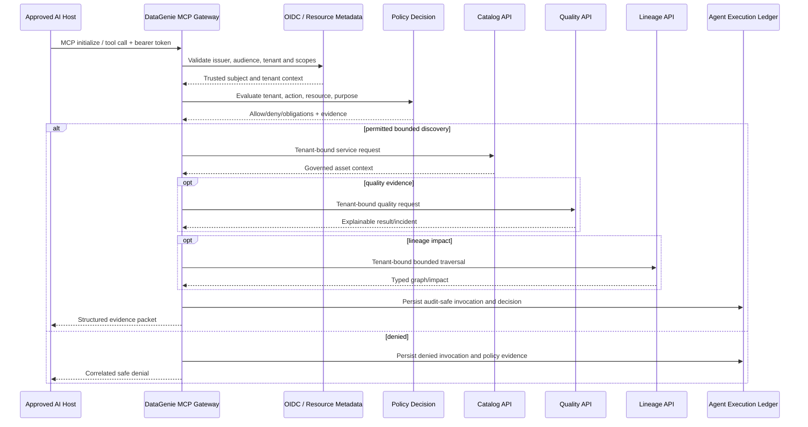

# Design: 0001-mcp-read-only-governed-discovery — MCP Read-Only Governed Discovery

**Status:** Implementing
**Requirements:** [requirements.md](requirements.md)
**Constitution review:** Pending approval

## Architecture summary

The pilot adds an `mcp-gateway` service as a remote, TLS-terminated MCP adapter. It owns MCP transport/session negotiation, OAuth/OIDC resource-server validation, tenant binding, scope enforcement, policy evaluation, tool/resource schema validation, response redaction/bounds, request correlation, rate limits and agent execution ledger records. It calls existing catalog, quality and lineage services through private service boundaries. It does not connect directly to their databases, duplicate business logic, or accept caller-provided tenant context.

## Components and responsibilities

| Component | Responsibility | Inputs/outputs | Tenant and authorization boundary |
|---|---|---|---|
| MCP gateway | MCP protocol, capability negotiation, token validation, schema validation, rate limits, response shaping and audit emission. | MCP JSON-RPC requests/responses. | Validates MCP audience/tenant/scopes; never trusts input tenant. |
| Identity adapter | OIDC/JWKS and protected-resource metadata integration. | Bearer token → subject, tenant, scopes, host/client evidence. | Rejects missing/incorrect audience, tenant or scope. |
| Policy decision adapter | Evaluates read access, declared purpose, asset classification and obligations. | Subject/tenant/action/resource/purpose → decision/evidence. | Explainable deterministic decision required. |
| Catalog client | Calls governed asset/search/index APIs. | Search/context requests → redacted metadata/evidence. | Trusted downstream actor context; private network only. |
| Quality client | Retrieves explainable quality and incident evidence. | Asset/version → run/rule/incident result. | Tenant/policy-aware; hides restricted evidence. |
| Lineage client | Retrieves bounded typed lineage impact. | Asset/direction/depth → graph/impact evidence. | Tenant/policy-aware with depth/result limits. |
| Agent execution ledger | Stores audit-safe tool invocation, policy decision and outcome metadata. | Correlation, digest, tool/version, duration, result class. | Tenant-scoped, excludes raw unrestricted content. |
| Durable task client | Creates/polls expensive impact task handles when synchronous budget is exceeded. | Task handle/status resource. | Task bound to caller/tenant; handle possession is insufficient. |

## Data flow and sequence

## MCP contract design

| Primitive | Identifier | Required scope | Side effect | Limits |
|---|---|---|---|---|
| Tool | `search_governed_assets` | `catalog:read` | None | Query/filter schema, max 50 results, no raw data. |
| Tool | `get_asset_context` | `catalog:read` | None | One asset, bounded column metadata, classification-aware redaction. |
| Tool | `get_quality_evidence` | `quality:read` | None | One asset/version, bounded run/incident history. |
| Tool | `analyze_lineage_impact` | `lineage:read` | None | Depth/result limit; tenant-visible graph only. |
| Resource | `datagenie://catalog/assets/{asset_id}` | `catalog:read` | None | Principal-specific response; no shared cache. |
| Resource | `datagenie://catalog/domains/{domain_id}` | `catalog:read` | None | Tenant-scoped ownership and stewardship summary. |
| Resource | `datagenie://policy/assets/{asset_id}` | `catalog:read` | None | Shared policy evidence/obligation summary for a declared purpose. |
| Resource | `datagenie://quality/assets/{asset_id}/latest` | `quality:read` | None | Explainable latest evidence only. |
| Resource | `datagenie://lineage/assets/{asset_id}` | `lineage:read` | None | Bounded graph summary. |
| Prompt | `assess_data_for_use` | Read scopes | None | Requires asset/business intent and purpose; returns structured decision-support template. |
| Prompt | `explain_lineage_impact` | `lineage:read` | None | Requires asset and depth/risk intention; returns structured analysis template. |
| Prompt | `summarize_governed_asset` | `catalog:read` | None | Requires asset/audience; returns structured context template. |

Formal schemas live under `contracts/`. The gateway will advertise only approved read-only capabilities; it will not proxy unknown REST paths.

## Identity and policy model

The gateway acts as an OAuth/OIDC resource server with MCP-specific token audience. It publishes protected-resource and authorization-server discovery metadata when remote authorization is enabled. It validates issuer, signature, expiry, audience, scopes and tenant claim before any domain invocation. The gateway uses a service identity downstream together with signed, tenant-bound actor context; it does not forward the host bearer token.

Policy evaluation calls the shared catalog policy interface and returns `allow`, `deny`, `allow_with_obligations`, or `requires_human_approval` with rule identifiers, evidence references and expiry. The beta binds this result to each asset tool response rather than advertising a fifth policy tool; it never persists an approval, certification or consent decision. The purpose parameter is required for decision-support prompts/tools where the response could be used for data-use selection. Every tool validates response redaction after downstream retrieval as defense in depth.

## Agent execution ledger

Each invocation creates a tenant-scoped record with: invocation ID, request ID, trace ID, tool/resource/prompt name and version, host/client identity, actor ID, tenant ID, normalized input digest, policy decision/rule IDs, response classification, result count/size, evidence IDs, duration, error code, timestamp and task handle if any. Raw values, raw data samples, bearer tokens and secret references are excluded by design.

## Failure, recovery and operations

| Condition | Expected behavior | Recovery | Signal |
|---|---|---|---|
| Invalid token/audience/tenant/scope | Safe `401`/`403` response and ledger entry. | Caller reauthorizes with minimum scope. | Auth denial metrics. |
| Policy unavailable | Fail closed for protected data decisions. | Retry after bounded backoff; alert platform owner. | Policy dependency error metric. |
| Catalog/quality/lineage timeout | Correlated bounded error; no partial assertion represented as complete. | Retry only idempotent read in defined budget. | Tool latency/error metrics. |
| Expensive lineage request | Return durable task handle/status resource. | Caller polls/cancels; worker owns retry/recovery. | Task status, queue metrics. |
| Response exceeds policy bound | Redact/truncate with explicit indicator; do not silently drop context. | Narrow query/depth/filter. | Result size metric. |
| Emergency risk | Disable tool/tenant/host via kill switch; preserve audit evidence. | Controlled re-enable after review. | Security incident alert/runbook. |

## Security and privacy design

Threat controls are specified in [threat-model.md](threat-model.md). The gateway enforces TLS ingress, rate limits, token audience binding, tenant context, host allowlisting for the pilot, result-size/depth bounds, input schema validation, response redaction, egress restrictions and no token passthrough. Tool/resource metadata and external data are treated as untrusted content; they cannot alter gateway instructions, policy or authorization. No raw data, secret or universal execution tool is introduced.

## Test strategy

The implementation must include MCP protocol/host interoperability, contract schema, role/scope/tenant-negative, policy-evidence, result-redaction, prompt-injection/malicious metadata, audience/token, task-handle ownership, timeout/rate-limit and correlation/audit tests. The canary must manually sample ledger records and compare tool output to existing DataGenie UI/API evidence.
