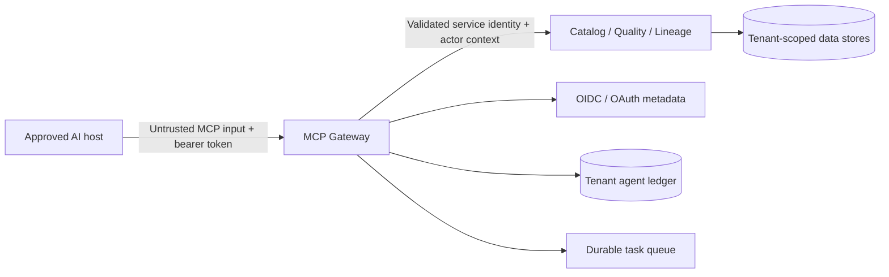

# Threat Model: 0001-mcp-read-only-governed-discovery — MCP Read-Only Governed Discovery

**Status:** Draft
**Security owner:** TBD
**Related design:** [design.md](design.md)

## Scope and trust boundaries

The pilot introduces a remote MCP gateway between an approved AI host and tenant-scoped DataGenie domain services. Trust boundaries include the public TLS ingress, host/client OAuth/OIDC flow, MCP transport/session, gateway policy engine, internal service calls, quality/lineage data stores, durable task queue, audit ledger and external identity metadata endpoints.

## Protected assets

| Asset | Sensitivity | Owner | Required protection |
|---|---|---|---|
| Tenant metadata, ownership and governance records | Confidential | Tenant/data steward | Validated tenant context, RBAC/policy, RLS/service filters and output redaction. |
| Quality and lineage evidence | Confidential/regulated by source classification | Data quality/platform | Tenant/policy checks, bounded traversal, redaction and provenance. |
| OAuth tokens and actor identity | Highly sensitive | Identity/platform | TLS, audience/issuer/signature/expiry checks; never log or forward tokens. |
| Tool outputs and prompt inputs | Potentially untrusted/sensitive | Tenant | Input/output schema, classification, size limits, content boundary and ledger digest only. |
| Agent execution ledger | Confidential audit evidence | Security/platform | Tenant scope, minimization, retention and export controls. |

## Threat analysis

| Threat / misuse case | Attack path | Impact | Required control | Verification |
|---|---|---|---|---|
| Cross-tenant tool input | Caller places a foreign tenant ID in a tool argument, URI or state handle. | Metadata disclosure or action against another customer. | Derive tenant from token only; ignore/reject tenant parameters; tenant-bound downstream context and negative tests. | Per-tool cross-tenant tests. |
| Wrong-audience/token passthrough | Gateway accepts any valid enterprise token or forwards it to downstream services. | Confused deputy and unauthorized downstream access. | MCP-specific audience validation; service identity downstream; no bearer token forwarding. | Invalid-audience and downstream-header tests. |
| Scope/role escalation | Host invokes a tool without required scope or combines scopes unexpectedly. | Unauthorized sensitive context. | Explicit per-tool scope matrix and policy revalidation. | Scope matrix tests. |
| Indirect prompt injection | Metadata, descriptions, glossary text or lineage labels instruct model/host to exfiltrate data or call tools. | Unsafe agent behavior or data leak. | Treat returned content as untrusted data; structured response fields, no instruction execution, host consent and tool allowlist. | Adversarial metadata fixtures. |
| SSRF / unsafe OAuth discovery | Malicious metadata or host causes gateway to access private URLs. | Internal network access or credential exposure. | HTTPS-only production discovery, private/link-local IP blocking, redirect validation, egress proxy/allowlist. | URL validation and egress tests. |
| State-handle hijack | Attacker guesses/reuses asynchronous lineage task handle. | Access to another caller/tenant result. | Non-deterministic handles bound server-side to tenant/subject; revalidate on poll/cancel. | Handle ownership tests. |
| Result overexposure | Broad search, column evidence or graph traversal returns too much data. | Excessive metadata/data disclosure and cost. | Result/depth/size limits, classification redaction, pagination/task handles and response indicators. | Bound/redaction tests. |
| Audit evasion | Tool action completes without durable record or logs raw sensitive content. | Investigation/compliance gap. | Ledger write is part of request lifecycle; digest/minimization policies; alert ledger failures. | Ledger required and secret-redaction tests. |
| Availability exhaustion | High-rate or deep impact calls exhaust gateway or graph. | MCP/API degradation. | Per-principal/tenant limits, timeouts, quotas, async execution and kill switch. | Load/timeout/rate limit tests. |

## Security requirements

DG-MCP-READ-001, DG-MCP-READ-006, DG-MCP-READ-007 and DG-MCP-READ-008 are security-critical. Their controls must be enabled before an external host can connect. A host approval/allowlist and a global/tenant/tool kill switch are mandatory for the internal beta.

## Residual risk and acceptance

| Residual risk | Compensating control | Accepted by | Review/expiry date |
|---|---|---|---|
| AI host may render untrusted metadata in an unsafe conversational context. | Approved-host onboarding, structured output, explicit host instruction, adversarial validation and read-only pilot scope. | Product/Security TBD | Before beta expansion |
| Full tenant isolation is not yet proven across every downstream microservice. | Enable only tools whose downstream path passes service-specific negative tests; keep others disabled. | Platform/Security TBD | Before each tool canary |

## Security test evidence

Required evidence includes dependency/secret scans, protected-resource/OIDC tests, audience and scope tests, tenant-negative tests, tool input/output validation, prompt-injection fixtures, URL/SSRF defenses, task-handle ownership checks, rate-limit tests, audit-minimization tests and manual security review of canary ledger samples.
