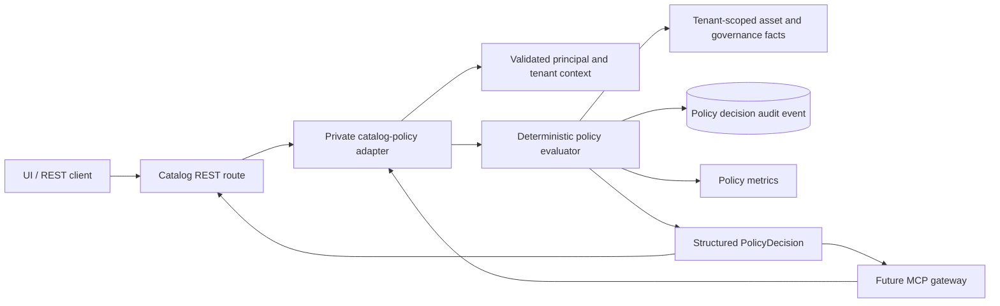

# Design: 0002-internal-policy-decision-interface — Internal Policy Decision Interface

**Status:** Draft
**Requirements:** [requirements.md](requirements.md)

## Architecture

The catalog API receives a `policy_service` module that centralizes deterministic authorization decisions. It is called from REST routes through a small `authorize_policy_action` adapter and may be called from trusted internal services. The policy service resolves tenant-scoped asset/governance facts through the existing SQLAlchemy session, applies a stable ordered rule set, persists a minimized `policy.decision` audit event, increments bounded metrics and returns an immutable typed decision.



## Typed interface

```python
PolicyDecision = evaluate_access(
    subject: Principal,
    tenant: str,
    action: str,
    resource: PolicyResource,
    purpose: str | None,
    context: PolicyContext,
    db: Session,
) -> PolicyDecision
```

`subject` is always a validated `Principal` or a trusted service subject produced by the same security layer. `tenant` is compared to the active principal/session tenant and never drives database scope. `resource` identifies a target by type/id and may include a private preloaded object only when it was obtained through the active tenant-scoped session. `purpose` is normalized, bounded and classified but not persisted raw. `context` permits request correlation and approved workflow IDs only; it is not a policy override channel.

## Decision structure

| Field | Meaning |
|---|---|
| `outcome` | `allow`, `deny`, `allow_with_obligations`, or `requires_human_approval`. |
| `rule_ids` | Ordered stable identifiers of evaluated/controlling deterministic rules. |
| `evidence` | Safe references to tenant context, role set, asset metadata version, classification/lifecycle/quality facts, owner/steward facts and workflow facts. |
| `obligations` | Machine-readable requirements, such as cite evidence, retain governed handling acknowledgement, or obtain eligible steward approval. |
| `expires_at` | UTC expiry derived from rule/fact volatility; default short TTL for sensitive or quality-dependent decisions. |
| `decision_version` | Code-owned policy bundle version. |
| `request_id` | Existing request correlation identifier. |
| `resource_visible` | Boolean that prevents foreign/nonexistent resource details being returned. |

## Rule evaluation order

| Order | Rule family | Behavior |
|---|---|---|
| 1 | Input/identity | Reject unsupported action/resource, tenant mismatch, invalid purpose or missing required request correlation. |
| 2 | Tenant scope | Resolve resource only in active tenant; foreign/nonexistent results remain non-visible. |
| 3 | RBAC baseline | Apply existing roles as a minimum action permission; platform administrator remains role-eligible but still subject to lifecycle/policy evidence. |
| 4 | Ownership/stewardship | Permit data-owner curation only of assets they own; permit steward governance actions; carry domain steward/owner evidence. |
| 5 | Lifecycle and certification | Deny general use of deprecated assets; require human workflow for certification action when current state/rule requires it. |
| 6 | Classification and purpose | Deny unpermitted sensitive use; otherwise issue specific handling/evidence obligations. |
| 7 | Quality freshness | For certification-dependent use, attach freshness evidence and downgrade to obligation/approval when quality is missing or stale. |
| 8 | Decision assembly | Emit ordered rule/evidence set, minimize audit metadata and compute bounded expiry. |

Deny rules take precedence. `requires_human_approval` is used only when the subject is otherwise eligible but an explicit existing human workflow must advance the action. `allow_with_obligations` is used only for a permitted action that must carry non-bypassable handling or evidence obligations.

## REST integration

`POST /api/v1/policy/decisions` accepts a caller-provided action/resource/purpose/context request but always uses the current authenticated principal and tenant. It is an explainability/decision-support endpoint and does not execute a governed mutation. It requires a read-capable principal for supported actions and applies the same action eligibility rules.

Initial route integration is explicit: asset read and curate in `assets.py`, plus quality evidence update, classification review and certification decision in `governance.py`. Each route calls the evaluator after tenant-scoped resource resolution and before mutation. Existing role dependencies remain as early coarse gates. Routes translate `deny` to the existing safe forbidden response and `requires_human_approval` to a correlated conflict/precondition response; no route treats obligations or approval requirements as success.

## Audit and metrics

The evaluator uses the existing tenant-scoped `AuditEvent` model with action `policy.decision` and safe metadata. This avoids a second audit storage universe while exposing a dedicated queryable event type. The event contains outcome, decision version, rule IDs, evidence reference IDs, expiry, action, purpose classification/digest, duration and visibility state. The service publishes Prometheus counters/histograms for outcome/action/rule family and latency; values never include raw subject, asset identifier, tenant, purpose or classification text as metric labels.

## Compatibility and future MCP adapter

The typed policy service is the canonical semantic contract. REST’s policy endpoint is a versioned external representation. The future MCP gateway invokes the same private service adapter using its validated tenant/actor context and records gateway-specific agent telemetry separately. It cannot bypass the evaluator, manufacture rule IDs/evidence, or treat an obligation/approval outcome as an allow.

## Failure and recovery

| Condition | Behavior |
|---|---|
| Tenant mismatch or non-visible resource | Safe deny with `resource_visible=false`; audit-minimized event. |
| Unsupported action/resource | Safe validation deny; no fallback route permission. |
| Evaluator/audit persistence failure | Protected routes fail closed and return correlated availability error; no mutation proceeds. |
| Quality fact unavailable | Certification/use policy returns obligation or human approval result, never unexplained allow. |
| Policy bundle deployment | Additive rule changes have a new decision version, contract test and change traceability. |
