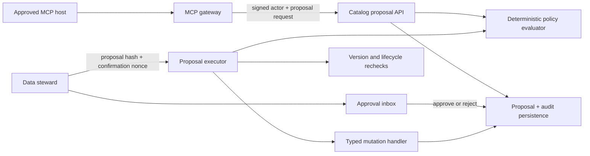

# Technical Design: 0003-proposal-only-governance-workflows

## Architecture

`GovernanceProposal` is an additive catalog-api aggregate. It is the authoritative lifecycle record for agent-originated governance change intent. Existing deterministic policy evaluation remains the single authorization authority. The MCP gateway never mutates catalog, quality, or lineage state directly; it delegates a signed actor packet to the catalog proposal API, which evaluates policy, captures evidence, and creates a proposal.

## Aggregate

The proposal stores immutable intent fields and mutable lifecycle fields. Immutable fields include tenant, type, title, proposal text, canonical diff, evidence, impact, initiating subject/model/host, source channel, source request ID, policy snapshot, resource version preconditions, hash, and creation expiry. Mutable lifecycle fields include status, approver/rejector, review note, approval version, nonce digest, confirmation expiry, cancellation reference, execution attempts, execution result, and transition timestamps.

| Field group | Purpose |
|---|---|
| Intent | Bound typed change request and canonical diff. |
| Context | Evidence, impact, source, initiating agent/model/host, and policy decision. |
| Preconditions | Resource identifier, technical version or request state version, and expected lifecycle/status. |
| Integrity | SHA-256 proposal hash calculated over canonical immutable content. |
| Approval | Status, steward, note, approval version, nonce digest, and confirmation expiry. |
| Execution | Attempts, terminal outcome, blocked reason, target resource, and audit relation. |

## Lifecycle

`PENDING_REVIEW → APPROVED → EXECUTED` is the successful path. A steward may transition `PENDING_REVIEW → REJECTED`. A requester or operator may cancel a nonterminal proposal. Expiry moves a pending or approved proposal to `EXPIRED` when read or executed. A failed execution recheck moves the proposal to `BLOCKED`; it never retries automatically. Only `APPROVED` proposals with a live confirmation nonce can enter execution.

## Confirmation and concurrency

Approval increments `approval_version`, creates a random confirmation nonce, stores only its SHA-256 digest, and expires it after a short interval. Execution locks the proposal row, verifies status/hash/nonce/expiry and current approver authorization, refreshes target resources under the tenant-scoped session, re-runs policy, checks version preconditions, and applies exactly one typed mutation in the same transaction. The terminal transition and audit event occur in that transaction. A unique execution transaction and terminal-status check make concurrent confirmation calls deterministic.

## Typed handlers

| Type | Diff schema | Execution outcome |
|---|---|---|
| `asset_curation` | `asset_id`, allowed curated fields, expected `technical_version` | Updates curation fields, writes metadata version, refreshes search index. |
| `certification_review_request` | `asset_id`, note, expected `technical_version` | Creates a pending certification request; does not certify the asset. |
| `quality_check_schedule` | `asset_id`, rule metadata, requested schedule, expected version | Creates a durable schedule-request record only; a separate eligible operator/worker process provisions a quality rule after its own checks. |

The initial scheduling handler deliberately creates a durable request rather than allowing a model to dispatch a job or inject a cron expression into a worker.

## Inbox

REST APIs list and retrieve proposals and provide approve, reject, cancel, and execute actions. The minimal HTML inbox is server-rendered from the same REST-ready data and uses explicit confirmation controls. It is a reference UI for internal stewards, not a replacement for the product frontend.

## Compatibility and failure behavior

Existing direct REST governance routes remain available to authenticated human workflows in this bounded release, but MCP has no route to them. All new catalog proposal APIs are versioned under `/api/v1/governance/proposals`. Policy/audit/database errors fail closed. Proposal hashes, nonces, version preconditions, and terminal transitions are validated server-side; no client-controlled field can override tenant, host, actor, policy outcome, approval, or resource state.
