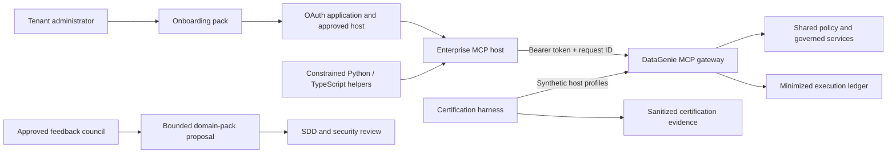

# Design: 0004-mcp-ecosystem-productization — MCP Ecosystem Productization

## Architecture

The existing MCP gateway remains the only public MCP resource server. A tenant administrator registers an OAuth application with the organization’s authorization server and configures an approved host identifier, redirect/origin policy where applicable, tenant allowlist, and requested least-privilege scopes. The host obtains its own bearer token for the gateway resource and calls the standard MCP Streamable HTTP endpoint.

## Component responsibilities

| Component | Responsibility | Explicit non-responsibility |
|---|---|---|
| Onboarding pack | Guides tenant-admin configuration, safe testing, expected handling, and support intake. | It does not create OAuth applications, tokens, or production access automatically. |
| Versioning policy | Defines compatibility semantics, deprecation notices, migration, and retirement rules. | It does not override MCP protocol-version negotiation or authorization policy. |
| Python/TypeScript helpers | Form validated standard JSON-RPC requests for the approved tool catalog and surface structured replies. | They do not own credentials, perform arbitrary dispatch, or provide direct write operations. |
| Certification harness | Validates a host profile against an in-process synthetic gateway and writes sanitized evidence. | It does not certify a partner organization or replace staging/OIDC validation. |
| Support procedure | Uses request ID, tenant, host, timestamp, tool, and safe error code to find minimized ledger evidence. | It does not request raw prompts, bearer tokens, or source credentials. |
| Domain-pack governance | Turns approved feedback into bounded, evidence-backed SDD changes. | It does not turn feedback into automatic tools or policy changes. |

## Helper contract

Both helpers contain an allowlisted tool map. `call_tool` is intentionally not an arbitrary RPC escape hatch: it accepts only tool names in the documented map and validates a minimal argument set before serializing `tools/call`. The helpers leave bearer-token acquisition, token refresh, client secret storage, transport proxying, and TLS termination to the enterprise host or its standard OAuth library.

The allowed names are the four governed discovery tools and the three proposal-intent tools. A helper rejects names such as `certify_asset`, `approve_proposal`, `execute_proposal`, `update_asset`, and `run_quality_check` before network dispatch. This adds a guardrail but does not replace gateway enforcement.

## Certification flow

The harness creates a synthetic gateway with two allowed host identifiers. Each profile performs protected-resource discovery, `initialize`, `tools/list`, a valid discovery call, and a negative direct-mutation call. It also validates missing `governance:propose` scope, malformed tool arguments, request-ID propagation, structured policy/provenance evidence, and the presence of a matching ledger entry. The artifact contains only assertions, profile names, safe request IDs, tool names, status codes, and ledger correlation facts.

## Domain-pack intake

An approved feedback record must contain the customer problem, domain, expected decision or evidence outcome, tenant impact, safety concern, and consented contact channel. Product triages the request, governance validates business ownership, security reviews policy and evidence exposure, and architecture opens an SDD change. Domain packs should prefer prompts, resources, search facets, policy evidence templates, and proposal types before proposing a new tool. Any new action must be proposal-only unless a separately approved human-controlled workflow proves otherwise.

## Failure handling

The onboarding and certification artifacts fail closed. Unknown tools, unsupported protocol versions, missing scopes, invalid credentials, malformed arguments, absent ledger records, or evidence that contains prohibited sensitive values fail certification. A customer administrator receives only safe corrective guidance and must not be instructed to disable tenant isolation, broaden scope, or bypass approval controls.
