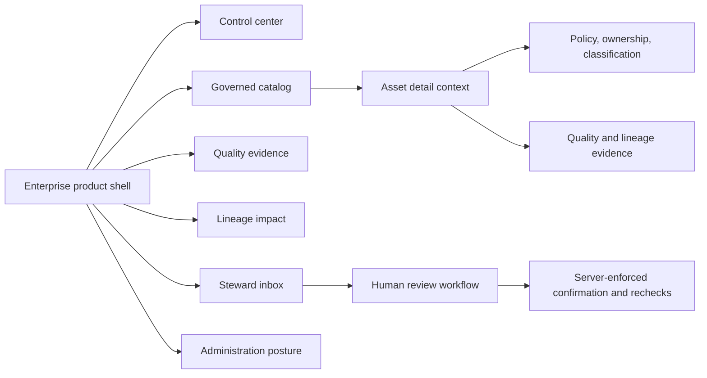

# Design: 0005-enterprise-datagenie-experience — Enterprise DataGenie Experience

## Experience architecture

The frontend becomes a single responsive workspace rather than a bare asset list. It uses a persistent left navigation, a context-aware top bar, and content workspaces that preserve tenant/environment and support-correlation visibility.

## Visual system

The interface uses a professional deep-slate foundation, high-contrast white content surfaces, indigo/blue action emphasis, teal healthy states, amber review states, and rose risk/blocked states. Typography favors compact, readable operational density; cards separate strategic KPIs from detailed evidence. Icons are lightweight inline symbols so the application remains dependency-light.

| Token family | Purpose | Example |
|---|---|---|
| `--ink-*` | Navigation and primary text | Deep navy and charcoal for stable enterprise hierarchy. |
| `--surface-*` | Application and card surfaces | Cool-white panels with subtle borders/shadows. |
| `--brand-*` | Primary action and selected states | Indigo/blue. |
| `--success-*`, `--warning-*`, `--danger-*` | Evidence and lifecycle status | Teal, amber, and rose with accessible text labels. |
| `--radius-*`, `--space-*` | Consistent form and panel rhythm | Compact controls; generous work-area spacing. |

## Page model

| Workspace | Primary job | Core components |
|---|---|---|
| Control center | Focus attention on outcomes and actions. | Coverage KPIs, quality trend, stewardship queue, operational/safety panel, recent activity. |
| Catalog | Find and evaluate a governed asset. | Search/facets, result table, selected asset detail, ownership/classification badges, evidence rail. |
| Quality | Explain confidence and remediation needs. | Freshness, score/context, rule coverage, incidents, evidence timeline. |
| Lineage | Understand bounded impact. | Upstream/downstream graph summary, affected consumers, confidence/bounds callout. |
| Proposals | Review pending governance intent safely. | Status/source/policy/evidence/impact cards; link to authorized inbox rather than client-side execution. |
| Administration | Show integrations, control posture, and support readiness. | Tenant posture, MCP status, audit/retention/role controls, request-ID support guidance. |

## Data and state model

The frontend loads assets from `VITE_DATAGENIE_API_BASE_URL` (defaulting to the current local catalog URL) and sends a bearer token only when `VITE_DATAGENIE_ACCESS_TOKEN` is supplied by the runtime. It never stores tokens itself. If the API is unavailable, the UI enters an explicit demonstration state using local synthetic data; the shell labels this clearly and never presents it as tenant evidence.

The primary request retains a generated request ID in React state. The interface displays the ID in the support area and uses it as `X-Request-ID`; it does not log or display secrets. Asset selection, workspace selection, search, filters, loading state, connection state, responsive navigation state, and notification state are local UI state only.

## Governance safety interactions

A proposal card can offer **View in steward inbox** and describe the human review/confirmation boundary. It does not provide a one-click browser mutation, approval, confirmation-nonce input, or execution action. Quality scores carry freshness and evidence text. Lineage carries confidence and bounded-depth text. Labels identify AI/MCP-originated content as a suggestion or proposal source, never as an approved action.

## Accessibility and responsiveness

Navigation, workspace switching, search, filters, table row selection, and dismissible notices use semantic buttons/inputs with labels and visible focus rings. The layout collapses the side rail into a mobile navigation strip below 980px and turns multi-column grids into one column below 720px. Tables retain semantic headers and switch to scroll containers only when necessary.
