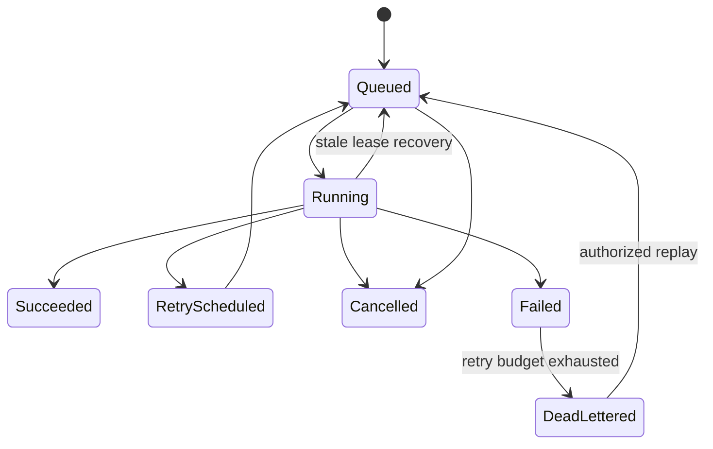

# Domain Specification: Durable Connector Execution

**Status:** Backfilled baseline
**Owner:** Data platform
**Constitution articles:** I, IV, V, VI, VII, VIII, IX

## Intent

DataGenie SHALL discover and synchronize source metadata through a connector framework that is durable, auditable, least-privileged, tenant-scoped, and recoverable. Connector work is customer-critical and shall not depend on an API request process remaining alive.

## Core requirements

| ID | Requirement | Required behavior |
|---|---|---|
| DG-CONNECT-001 | A connector SHALL declare its capabilities, configuration validation, credential/secret-reference handling, discovery behavior, profiling behavior, incremental synchronization, cancellation and retry compatibility. | Connector contract and validation result. |
| DG-CONNECT-002 | Raw source credentials SHALL be rejected at product boundaries; only supported external secret references may be persisted. | No raw secret in model, API, logs, audit or worker payload. |
| DG-CONNECT-003 | Ingestion submission SHALL create a durable tenant-scoped job and queue work to a dedicated worker. | API returns task/job identity without inline harvest execution. |
| DG-CONNECT-004 | Each job SHALL record source, tenant, request/actor context, task identifier, parent/retry lineage, lease, status, cursor, fingerprint/watermark, timing, attempt count and terminal reason. | Durable job history. |
| DG-CONNECT-005 | Jobs SHALL enforce bounded soft/hard timeouts, cancellation, retries with backoff, stale-lease recovery, idempotent terminal transitions, dead-letter state and controlled replay. | Worker and API regression coverage. |
| DG-CONNECT-006 | Incremental sync SHALL retain source-specific cursors and reconcile discovered metadata without overwriting steward-curated fields. | Fingerprint/watermark and curation-safe synchronization. |
| DG-CONNECT-007 | Failed, dead-lettered, stale, or cancelled work SHALL be operationally visible with correlated audit/log/metric evidence. | Runbook, alert, worker and job evidence. |

## State model

## Security and isolation

Workers derive tenant context from the persisted job record; queue callers cannot select arbitrary tenant identity. Connector service accounts must receive the minimum source privilege, and secret references must resolve only in the approved execution environment. All outbound connection targets are configuration-validated and must follow network/egress policy.

## Failure and recovery behavior

| Condition | Required response |
|---|---|
| Queue unavailable | API returns correlated temporary failure; no local synchronous fallback. |
| Worker loss / lease expiry | Job becomes recoverable under stale-lease controls; duplicate execution is prevented or idempotently reconciled. |
| Transient source failure | Bounded backoff retry with durable attempt history. |
| Retry exhaustion | Terminal dead-letter state, audit evidence, operator alert and authorized replay path. |
| Cancellation | Worker observes cancellation at safe boundary; no falsely successful terminal state. |

## Authoritative implementation references

- `apps/catalog-api/app/services/ingestion_service.py`
- `apps/catalog-api/app/api/v1/sources.py`
- `apps/catalog-api/app/api/v1/ingestion_jobs.py`
- `apps/catalog-api/app/workers/celery_app.py`
- `apps/catalog-api/app/workers/tasks.py`
- `apps/catalog-api/alembic/versions/20260821_07_durable_connector_jobs.py`
- `apps/catalog-api/tests/test_connector_queue_api.py`
- `apps/catalog-api/tests/test_connector_worker.py`
