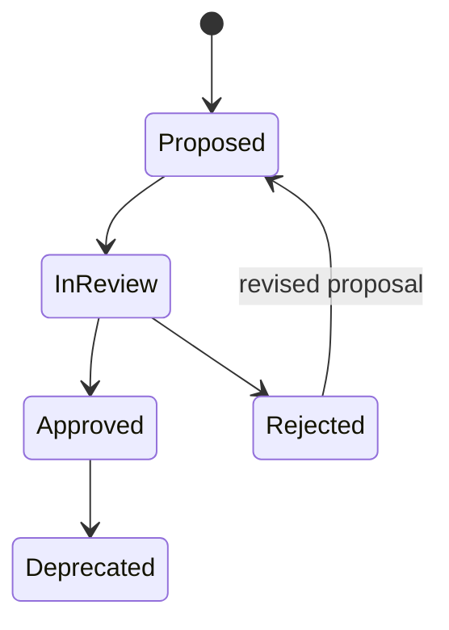

# Domain Specification: Governance Approval and Human-Reviewed Assistance

**Status:** Backfilled baseline
**Owner:** Data governance
**Constitution articles:** II, III, IV, V, VIII, IX

## Intent

DataGenie SHALL help people govern data without allowing automated systems to become an unaccountable governance authority. Glossary definitions, asset mappings, classifications, certifications, ownership decisions, metadata curation, and AI assistance are governed records with named accountable humans, evidence, lifecycle state, and audit history.

## Core requirements

| ID | Requirement | Lifecycle / evidence |
|---|---|---|
| DG-GOV-001 | Domains SHALL have accountable ownership and stewardship. | Governance domain record and tenant-scoped audit history. |
| DG-GOV-002 | Glossary terms and glossary-to-asset mappings SHALL support proposal, review, approval, rejection, and deprecation states. | Review actor, timestamp, rationale, linked asset/column and version. |
| DG-GOV-003 | Sensitive-data classification detection SHALL be an aid only; no finding SHALL be treated as autonomous compliance or final classification. | Detector/evidence, steward review, correction, decision and audit. |
| DG-GOV-004 | Certification SHALL be a request-and-decision workflow distinct from technical quality and business criticality. | Request, decision, reviewer, rationale and affected asset version. |
| DG-GOV-005 | Governance suggestions, including AI-generated descriptions, owner hints, glossary mappings, lineage summaries, metadata gaps and quality-rule recommendations, SHALL be clearly labeled as suggestions with evidence. | Suggestion type, source, evidence, status, reviewer and approval/rejection. |
| DG-GOV-006 | A governance-impacting suggestion SHALL NOT mutate the governed target until an eligible human approval is recorded and execution revalidates current authorization and version conditions. | Proposal/approval/execution audit sequence. |
| DG-GOV-007 | Discovery success SHALL be measured from search sessions leading to a qualifying asset view, certification request, or approved use decision. | Tenant-scoped discovery event and metric evidence. |

## State models

For AI assistance, the initial state is always `suggested`; UI and API surfaces must preserve origin, evidence, confidence only where meaningful, and the requirement for a human decision.

## Authorization and segregation of duties

| Actor | Permitted actions | Prohibited actions |
|---|---|---|
| Analyst/read-only | Discover approved information and view permitted evidence. | Approve governance changes. |
| Data owner | Curate assets they own and participate in relevant decisions. | Override tenant/domain restrictions. |
| Data steward | Review domains, glossary, classifications, certifications and suggestions within authorization scope. | Bypass required evidence or tenant controls. |
| Platform administrator | Manage platform-controlled operations and audit access. | Implicitly become business owner without an accountable domain assignment. |
| AI/automation | Create labeled drafts/proposals with evidence. | Approve or apply governance-impacting changes. |

## Failure behavior

A missing/invalid reviewer, stale target version, revoked role, unresolved classification conflict, incomplete evidence, or expired approval SHALL keep the record non-executable. The system SHALL return a safe, correlated error and retain an audit decision without exposing restricted tenant data.

## Authoritative implementation references

- `apps/catalog-api/app/api/v1/governance.py`
- `apps/catalog-api/app/services/governance_service.py`
- `apps/catalog-api/app/models/catalog.py`
- `apps/catalog-api/app/schemas/governance.py`
- `apps/catalog-api/tests/test_governance_discovery.py`
- `docs/governance-lineage-contract.md`
