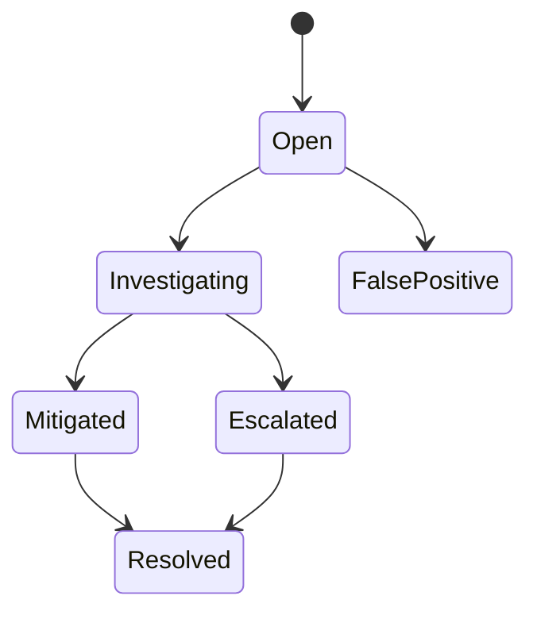

# Domain Specification: Explainable Data Quality

**Status:** Backfilled baseline
**Owner:** Data quality
**Constitution articles:** III, IV, VI, VIII, IX

## Intent

DataGenie SHALL present data quality as durable, explainable evidence—not an unexplained score. Technical quality, business criticality, and certification are distinct concepts. A quality result may inform a use decision but shall not independently authorize, certify, or reject a data asset.

## Core requirements

| ID | Requirement | Required evidence |
|---|---|---|
| DG-QUALITY-001 | Quality rules SHALL be attached to an asset or column, have an owner, lifecycle state, threshold, schedule/manual trigger, and immutable version history. | Rule ID/version, owner, scope, threshold, change history. |
| DG-QUALITY-002 | The initial supported rule families SHALL include completeness, uniqueness, validity, freshness, referential integrity, and distribution anomaly. | Rule configuration and deterministic evaluation evidence. |
| DG-QUALITY-003 | A quality run SHALL persist status, timing, profile context, exact rule version, result, threshold, score/explanation, affected rows/columns where safe, and correlation/job references. | Durable run/result records with evidence. |
| DG-QUALITY-004 | A result lacking explanation SHALL NOT be represented as authoritative quality. | Response/UI label and evidence requirement. |
| DG-QUALITY-005 | Quality incidents SHALL track severity, status, assignee, comments, evidence, resolution history and impacted downstream assets where lineage exists. | Incident timeline and lineage impact references. |
| DG-QUALITY-006 | Scheduled and manually triggered checks SHALL execute asynchronously with idempotency, timeout, retry, cancellation, and durable recovery semantics. | Worker/job history and operator controls. |
| DG-QUALITY-007 | Critical-asset coverage SHALL measure recent explainable quality results with accountable ownership, not merely aggregate score availability. | Metric definition and tenant-scoped denominator. |

## Evidence contract

```text
quality decision = result + rule version + threshold + input/profile context
                 + execution time + asset/column identity + owner + incident state
```

Every quality response must expose enough structured context for a user, policy engine, or MCP tool to explain the conclusion. Outputs containing sensitive row evidence must be classification-aware and never cross tenant boundaries.

## Incident and remediation model



A resolved incident must retain the resolution rationale and link to evidence. An incident’s impact analysis is advisory unless an approved policy explicitly declares an operational action.

## Failure behavior

A failed or timed-out run must be distinguishable from a low-quality result. Rules must not silently disappear after failure. Retry exhaustion must create durable failure/incident evidence and alert appropriate operators. The latest successful quality result must not be represented as current if freshness requirements are no longer met.

## Authoritative implementation references

- `apps/quality-api/app/models/quality.py`
- `apps/quality-api/app/services/rule_engine.py`
- `apps/quality-api/app/workers/tasks.py`
- `apps/quality-api/app/workers/celery_app.py`
- `apps/quality-api/tests/`
- `docs/governance-lineage-contract.md`
