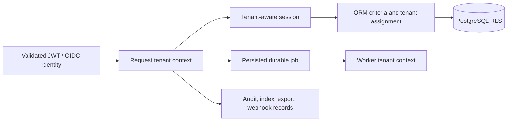

# Platform Specification: Tenant Isolation

**Status:** Backfilled baseline
**Owner:** Data platform
**Constitution articles:** I, IV, V, VII, VIII, IX

## Intent

DataGenie SHALL prevent one customer or tenant from reading, inferring, mutating, exporting, receiving events about, or replaying work associated with another tenant. Tenant isolation is a design property enforced through identity, application sessions, database policy, worker context, audit records, search documents, customer operations, and negative tests—not a convention left to endpoint authors.

## Invariants

| ID | Requirement | Evidence boundary |
|---|---|---|
| DG-TENANT-001 | Every authenticated non-development request SHALL derive the active tenant from the validated configured identity claim. | `app/core/security.py` and authentication tests. |
| DG-TENANT-002 | A caller SHALL NOT set or override tenant identity through URL, query, body, job, or tool parameters. | Tenant-aware ORM assignment and API boundary tests. |
| DG-TENANT-003 | Tenant-scoped persistence records SHALL have a non-null tenant key and application-level filtering; PostgreSQL deployments SHALL also use RLS policy enforcement. | Catalog model/session and migration `20260821_06_tenant_isolation`. |
| DG-TENANT-004 | Primary-key lookup, identity-map behavior, cache/result reuse, search documents, audit records, retention, exports, and webhooks SHALL remain tenant-bound. | Tenant session implementation and cross-tenant regression tests. |
| DG-TENANT-005 | A durable worker SHALL receive tenant context only from a persisted job or trusted service context and SHALL rebind it before execution. | Connector worker/task and job tests. |
| DG-TENANT-006 | Authorization failures SHALL not disclose whether another tenant owns a resource. | API authorization and audit tests. |

## Control model

## Failure behavior

| Condition | Required behavior |
|---|---|
| Missing tenant claim outside development | Reject authentication; do not create a fallback tenant. |
| Tenant context absent in a scoped session | Fail safely; do not execute unscoped queries or writes. |
| Stale tenant identity map / lookup | Refresh through tenant criteria; never return an in-memory object from another tenant. |
| Tenant mismatch in persisted job | Reject execution, mark evidence, and require operator investigation. |
| RLS misconfiguration | Deployment validation and non-owner application-role tests are release gates. |

## Verification baseline

The baseline includes ORM read/write isolation, forged write-key replacement, API list/retrieve isolation, audit-history isolation, and production token tenant-claim tests. The next required proof is a full multi-service negative suite covering quality, lineage, search, workers, exports, and MCP gateway paths using a PostgreSQL non-owner application role.

## Authoritative implementation references

- `apps/catalog-api/app/core/tenant.py`
- `apps/catalog-api/app/core/security.py`
- `apps/catalog-api/app/db/session.py`
- `apps/catalog-api/alembic/versions/20260821_06_tenant_isolation.py`
- `apps/catalog-api/tests/test_tenant_isolation.py`
- `apps/catalog-api/tests/test_tenant_api_boundary.py`
